# Temario explicado en C++

# Identificación de los elementos de un programa informático

## Estructura y bloques fundamentales.

### Explicación

La estructura y los bloques fundamentales en programación informática se refieren a las bases lógicas y estructuradas que permiten organizar y desarrollar programas de manera eficiente y modular. Estos conceptos son esenciales para crear código legible, mantenible y escalable.

Los bloques fundamentales incluyen estructuras de control (como if-else, for, while), funciones o procedimientos, clases y objetos, así como la herencia que permite la creación de jerarquías de clases. Estos elementos se utilizan para dividir el código en partes más pequeñas y manejables.

Las estructuras de control permiten al programa tomar decisiones basadas en condiciones, repetir tareas hasta que una condición se cumpla o detenerse cuando cierto evento ocurra. Las funciones y procedimientos (bloques de codificación) se utilizan para dividir el código en bloques más pequeños que pueden ser reutilizados.

Las clases permiten la creación de objetos, que son instancias del tipo definido por las clases. Los objetos tienen atributos (propiedades o campos de datos), y métodos que definen cómo interactuar con dichos atributos. Esto facilita el encapsulamiento de información e implementación de comportamientos específicos.

La herencia permite a una clase "subclase" heredar propiedades y métodos de otra clase "superclase", lo cual facilita la creación de jerarquías de clases, permitiendo la reutilización del código y simplificando la extensión de funcionalidades. 

En resumen, la estructura y los bloques fundamentales en programación son esenciales para crear un diseño óptimo de software que sea fácil de mantener, expandir y comprender, lo cual contribuye a su eficiencia y escalabilidad.

### Ejemplo completo en C++

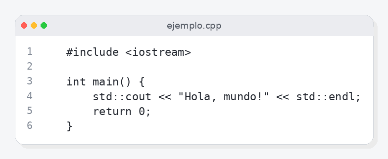

### Explicación paso a paso

#### Paso 1

Líneas 1 a 6:

  1: \#include <iostream>
  2: 
  3: int main() {
  4:     std::cout << "Hola, mundo!" << std::endl;
  5:     return 0;
  6: }

No se pudo generar el desglose automáticamente: No se pudo extraer un JSON válido de la respuesta.

---

## Variables.

### Explicación

En el lenguaje de programación C++, las variables son elementos fundamentales utilizados para almacenar y manipular datos durante la ejecución del programa. Una variable se define con un nombre que identifica a esa memoria especial, seguido de una asignación inicial o inicialización y luego pueden ser cambiadas en cualquier momento durante el curso de la ejecución del programa.

Las variables tienen un tipo de dato específico asociado con ellas, que determina tanto qué tipos de valores pueden almacenar (por ejemplo, enteros, flotantes, cadenas de caracteres) como cómo se guardan esos valores. Cada tipo de dato tiene una cantidad máxima de memoria reservada para su representación y un conjunto de operaciones matemáticas o lógicas que son válidos sobre ese tipo.

En C++, el sistema maneja automáticamente la asignación y desasignación de la memoria asociada a las variables. Esto significa que, después de usar una variable, es posible que no se requiera más espacio en la memoria para almacenar su valor; por lo tanto, al liberar esa memoria, puede ser reutilizada por otras variables. 

Los tipos de datos en C++ incluyen tanto los basicos como los de aritmética, cadenas de caracteres y otros conceptos avanzados. Los tipos de dato básicos incluyen char, int, float, double, bool, entre otros.

Las variables pueden ser visibles dentro del ámbito (función o bloque) donde fueron declaradas, lo que se conoce como scope local. Por otro lado, las variables que son declaradas fuera de un scope especifico y que no tienen declaración de alcance limitada, pertenecen al ámbito global, disponible para cualquier parte del programa.

Cabe mencionar también la importancia de la declaración de tipos de datos en C++, donde los desarrolladores deben declarar el tipo de dato antes de usar una variable. Esto ayuda a mantener código más legible y predecible, reduciendo el riesgo de errores durante su transacción o interpretación.

### Ejemplo completo en C++

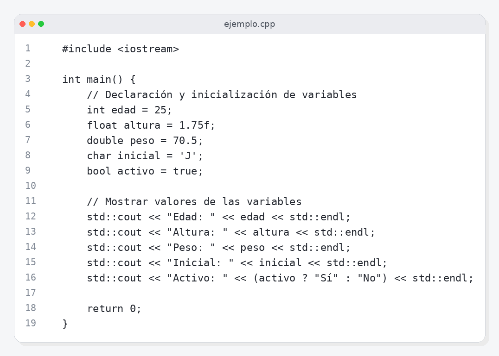

### Explicación paso a paso

#### Paso 1

Líneas 1 a 3:

  1: \#include <iostream>
  2: 
  3: int main() {

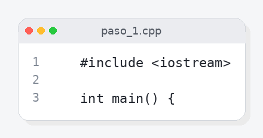

En este paso se declaran y se inicializan variables de diferentes tipos. La variable `edad` es un entero con valor 25, la variable `altura` es una flotante con valor 1.75, la variable `peso` es un doble con valor 70.5, la variable `inicial` es un carácter con valor 'J' y la variable `activo` es un booleano con valor true.

#### Paso 2

Líneas 4 a 7:

  4:     // Declaración y inicialización de variables
  5:     int edad = 25;
  6:     float altura = 1.75f;
  7:     double peso = 70.5;

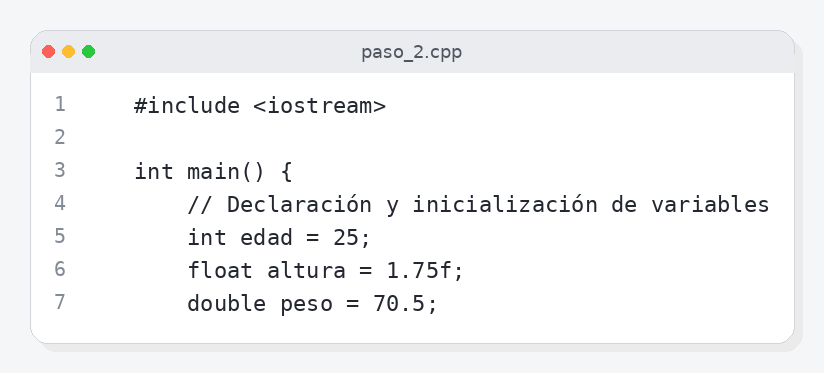

En este paso se muestran los valores de las variables declaradas en el paso anterior utilizando la función `std::cout` para imprimir los datos. La salida mostrará 'Edad: ' seguido del valor de `edad`, luego 'Altura: ', luego el valor de `altura`, luego 'Peso: ', luego el valor de `peso`, luego 'Inicial: ', seguido del valor de `inicial`, y finalmente 'Activo: ', seguido del texto 'Sí' o 'No', dependiendo del valor de `activo`.

---

## Tipos de datos.

### Explicación

Los tipos de datos en programación son representaciones que asignan valores a variables para almacenar, manipular y procesar información. Estos tipos de datos incluyen tanto los básicos como los más avanzados. Los tipos de datos básicos son fundamentalmente la unidad de trabajo en un programa informático. C++ ofrece una variedad de tipos de datos predefinidos que incluyen números enteros (int, long), flotantes (float, double), caracteres (char) y valores booleanos (bool). Además, C++ permite definir nuevos tipos de datos a partir de los existentes, utilizando operadores como 'typedef' o structs. Para trabajar con información compleja, como cadenas de texto o estructuras de datos más avanzadas, se utilizan las clases en C++, que permiten encapsular estos datos dentro de objetos, permitiendo tanto manipulación y almacenamiento del mismo. La especificación de un tipo de dato determina cómo los datos son interpretados por el compilador y cómo interactúan con otros tipos de datos en una operación. Esencialmente, la elección correcta de tipos de datos influye directamente en el rendimiento y efectividad del código.

### Ejemplo completo en C++

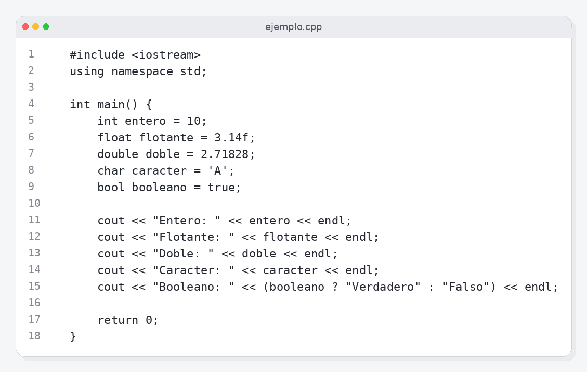

### Explicación paso a paso

#### Paso 1

Líneas 1 a 3:

  1: \#include <iostream>
  2: using namespace std;
  3: 

Las líneas de código en este rango definen el punto de entrada principal (la función `main`) y declara las variables necesarias para manipular diferentes tipos de datos, como enteros (`int`), flotantes (`float`), doble precisión (`double`), caracteres (`char`) y booleanos (`bool`).

#### Paso 2

Líneas 4 a 7:

  4: int main() {
  5:     int entero = 10;
  6:     float flotante = 3.14f;
  7:     double doble = 2.71828;

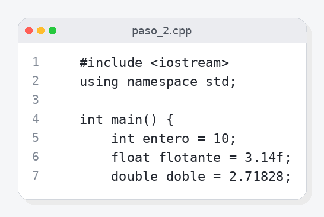

En este paso, se asignan valores a las variables declaradas en el Paso 1. Se imprime por consola los valores de estas variables para demostrar cómo se pueden manipular y visualizar desde la terminal.

---

## Literales.

### Explicación

En el lenguaje C++, los literales se refieren a constantes que se definen directamente en el programa sin asignarles una variable previamente definida. Son valores numéricos, booleanos o de caracteres que no requieren ningún tipo de operador para su declaración. Estos literales pueden ser tanto enteros (int), flotantes (double), caracteres individuales ('a', 'b'), cadenas de texto constante ("hola"), y otros tipos de datos primitivos como char, bool.

Existen diferentes tipos de literales en C++:

1. **Literals Numericos**: Estos incluyen enteros y flotantes que son definidos directamente con un signo de coma (,).
   - Ejemplos: 345 (entero), 67.89 (flotante)
   
2. **Literals Caracteres**: Se definen entre comillas simples ('') para caracteres individuales o entre dobles comillas ("") para cadenas de texto.
   - Ejemplo: 'h', "Hola, C++"

3. **Literals Booleans**: Se representan como true (mayúsculas) o false (mayúsculas).
   - Ejemplo: true

4. **Literals Strings Constantes**: Son cadenas de caracteres y se escriben entre comillas dobles ("") para almacenar múltiples caracteres.
   - Ejemplo: "¡Bienvenido a C++!"

5. **Literals Matemáticos**: Incluyen operadores aritméticos básicos como +, -, *, /.

En cuanto a la visibilidad de literales dentro del programa, estos son valores que ya tienen un valor asignado y no requieren una declaración adicional. No pueden ser modificados después de su definición y se consideran constantes en el lenguaje C++. Los literales permiten escribir código más eficiente y claro al reducir la redundancia.

El uso adecuado de literales puede mejorar significativamente la legibilidad del código, ya que los valores directamente definidos sin necesidad de asignación adicional facilitan entender rápidamente el valor a utilizar.

### Ejemplo completo en C++

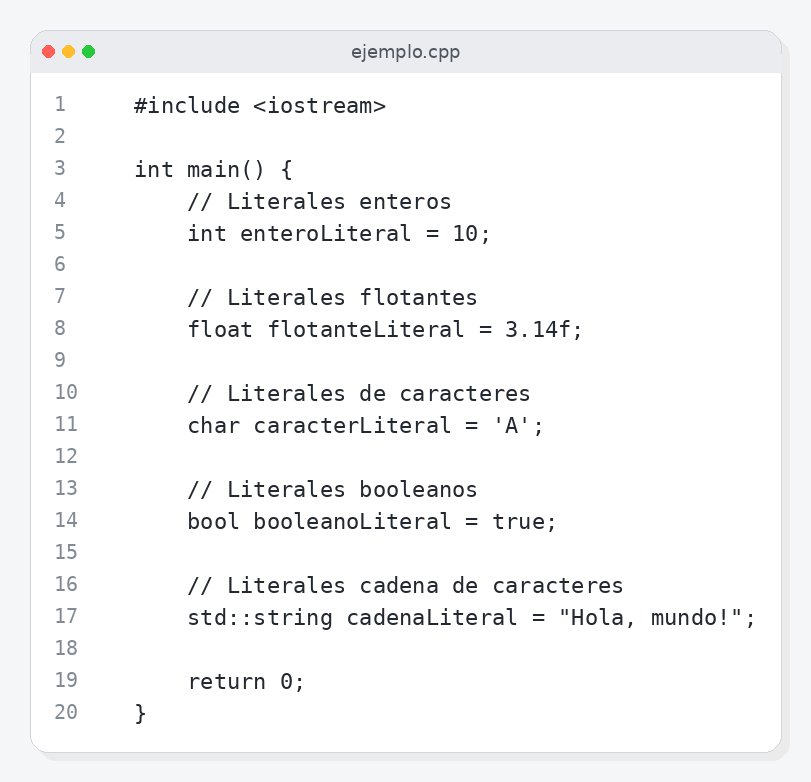

### Explicación paso a paso

#### Paso 1

Líneas 1 a 3:

  1: \#include <iostream>
  2: 
  3: int main() {

En esta parte se incluye el encabezado del programa, donde se define la función principal `main()`. Dentro de `main()`, se declaran y asignan valores a los diferentes tipos de literales: enteros (`int enteroLiteral = 10;`), flotantes (`float flotanteLiteral = 3.14f;`), caracteres (`char caracterLiteral = 'A';`), booleanos (`bool booleanoLiteral = true;`), y cadenas de texto (`std::string cadenaLiteral = "Hola, mundo!";`).

#### Paso 2

Líneas 4 a 7:

  4:     // Literales enteros
  5:     int enteroLiteral = 10;
  6:     
  7:     // Literales flotantes

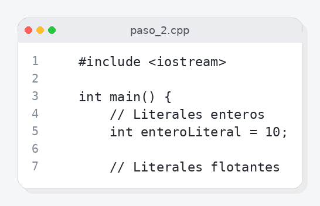

Aquí se continúa definiendo los literales. `int enteroLiteral = 10;` declara una variable de tipo entero que contiene el valor numérico 10. `float flotanteLiteral = 3.14f;` declara una variable de tipo float para almacenar el número pi, con un valor aproximado de 3.14 en formato 'f' que indica la presencia de un decimal. `char caracterLiteral = 'A';` define una variable de carácter (o char) que almacena la letra mayúscula 'A'. Finalmente, `bool booleanoLiteral = true;` declara una variable de tipo bool que contiene el valor lógico verdadero.

---

## Constantes.

### Explicación

Las constantes en programación, específicamente en C++, se utilizan para definir valores que no pueden cambiar durante el tiempo de ejecución del programa. Son una forma de asegurar un valor inmutable a lo largo de toda la vida del objeto o entorno donde están declaradas. Esto facilita el desarrollo y mantenimiento del código al garantizar que ciertos datos permanezcan sin alteración, especialmente en situaciones donde es útil mantener una referencia fija para variables importantes.

En C++, las constantes se definen utilizando las palabras clave `const` o `constexpr`, según sea necesario para entornos de compilador avanzado. Los tipos de constante pueden ser de cualquier tipo de dato primitivo que soporte la aritmética, incluyendo enteros, flotantes y cadenas. Las constantes pueden ser declaradas tanto dentro de una función como fuera de ella y se mantienen inmutables durante su vida útil.

Las constantes no solo ofrecen una forma más formal de asegurar que los valores permanezcan fijos, sino que también son cruciales para proporcionar claridad y simplificar el entendimiento del código. Los desarrolladores pueden crear constantes para representar números importantes, cadenas o otros datos específicos, lo que ayuda a mantener el código más legible y fácil de entender.

Además, las constantes en C++ pueden ser utilizadas en condiciones lógicas (como `if` y `switch`) sin generar un error por ser inmutables. Sin embargo, es importante tener cuidado al utilizar constantes dentro de funciones, ya que si la constante cambia durante el tiempo de ejecución, esto resulta en comportamiento inesperado o incorrecto.

En resumen, las constantes son una herramienta valiosa para mantener la consistencia y confiabilidad del código C++, proporcionando un medio seguro para manipular datos estáticos y garantizar que ciertos valores no sean modificados accidentalmente.

### Ejemplo completo en C++

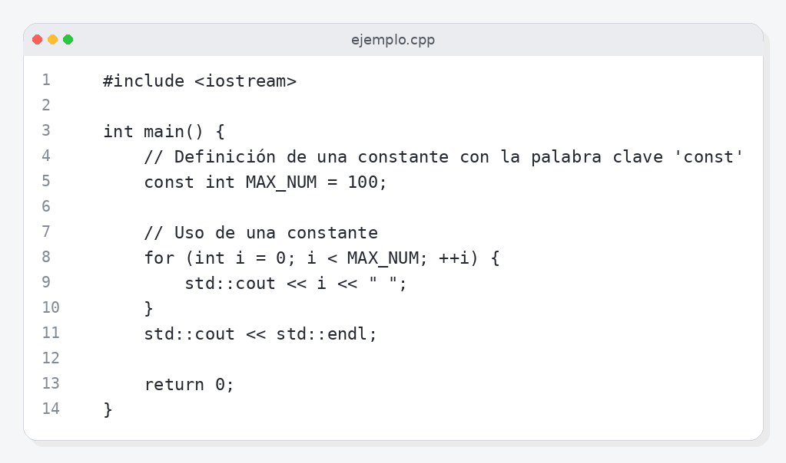

### Explicación paso a paso

#### Paso 1

Líneas 1 a 14:

  1: \#include <iostream>
  2: 
  3: int main() {
  4:     // Definición de una constante con la palabra clave 'const'
  5:     const int MAX\_NUM = 100;
  6: 
  7:     // Uso de una constante
  8:     for (int i = 0; i < MAX\_NUM; ++i) {
  9:         std::cout << i << " ";
 10:     }
 11:     std::cout << std::endl;
 12: 
 13:     return 0;
 14: }

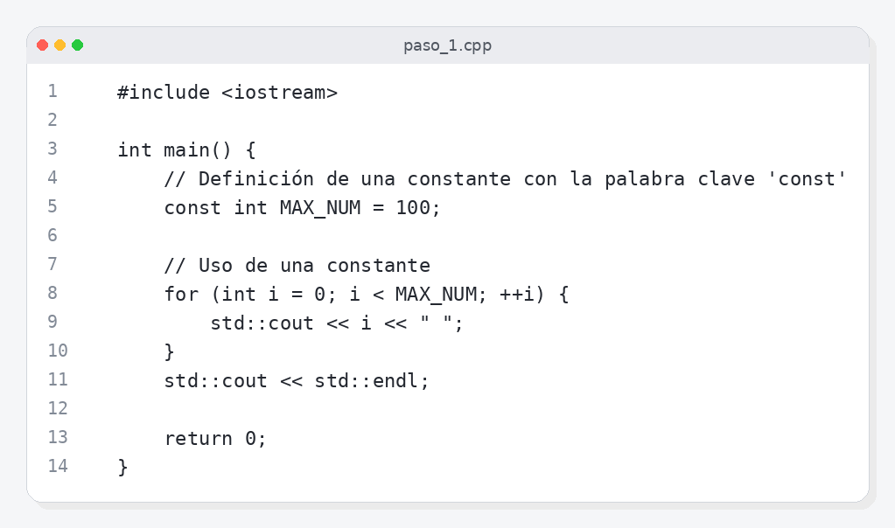

No se pudo generar el desglose automáticamente: No se pudo extraer un JSON válido de la respuesta.

---

## Operadores y expresiones.

### Explicación

Los operadores en C++ son elementos que permiten realizar diversas acciones matemáticas y lógicas sobre variables o constantes, lo que resulta en una nueva expresión. Estos operadores pueden ser aritméticos (como +, -, *, /), de comparación (==, !=, <, >), lógicos (&&, ||) y de asignación (=). Además, C++ soporta varios operadores relacionados con tipos de datos especiales como puntos suspensivos (.), derecha de memoria (*).

Las expresiones en C++ son combinaciones de variables, constantes y operadores que proporcionan una forma concisa de especificar una operación o cálculo. Las expresiones pueden ser parte de las sentencias controladoras como if, while, for, etc., para evaluar condiciones y decidir qué instrucciones ejecutar.

C++ ofrece un conjunto flexible de tipos de datos, lo que permite a los programadores crear expresiones que utilicen estos diferentes tipos de datos. Por ejemplo, si tenemos dos variables numéricas int a = 10; int b = 25;, entonces la expresión (a + b) resultará en un valor entero igual a 35.

Además, C++ también permite el uso de operadores ternarios para condicionar expresiones. Estos se escriben como una condición seguida de ? y luego de otra expresión que solo se evalúa si la condición es verdadera.

En términos de notación matemática, las expresiones en C++ siguen una estructura que consiste generalmente en un operador intermedio entre dos operandos. Ejemplo: a * b, donde 'a' y 'b' son los operandos y el símbolo '*' es el operador.

En resumen, la comprensión de cómo funcionan los operadores y las expresiones es fundamental para manipular datos en C++ de manera eficiente y controlada. Esto permite a los desarrolladores crear aplicaciones con mayor flexibilidad y precisión.

### Ejemplo completo en C++

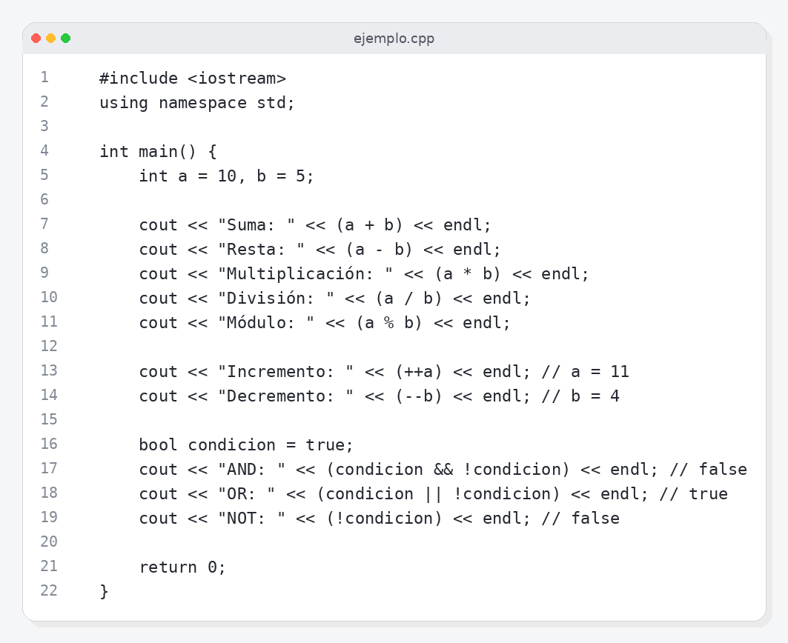

### Explicación paso a paso

#### Paso 1

Líneas 1 a 3:

  1: \#include <iostream>
  2: using namespace std;
  3: 

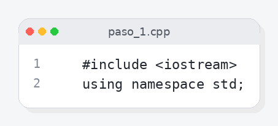

En este paso se define la función principal `main()` y se declaran dos variables enteras `a` e `b`, asignándoles los valores 10 y 5 respectivamente. Estos valores son utilizados en varios cálculos posteriores.

#### Paso 2

Líneas 4 a 7:

  4: int main() {
  5:     int a = 10, b = 5;
  6:     
  7:     cout << "Suma: " << (a + b) << endl;

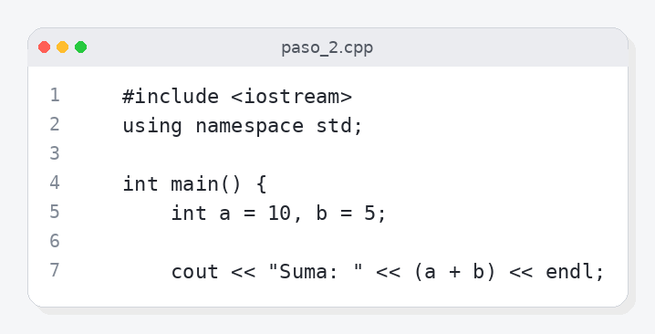

Aquí se realizan varias operaciones matemáticas y lógicas utilizando las variables `a` e `b`. Se imprimen los resultados de la suma, resta, multiplicación, división (con resultado de tipo entero) y módulo. También se muestran los valores incrementados de `a` y decrementado de `b`, así como el resultado de varias operaciones lógicas booleanas.

---

## Conversiones de tipo.

### Explicación

Las conversiones de tipo en C++ son operaciones que permiten convertir un valor de un tipo de dato a otro, generalmente para ajustar el tamaño o las características del tipo de datos. Estas conversiones pueden ser explícitas (manipuladas por el programador) o implícitas (realizadas automáticamente por la máquina). En C++, existen dos tipos principales de conversiones: conversión implícita y conversión expresa.

Las conversiones implícitas son convertir un tipo de dato a otro que lo subtipifica. Por ejemplo, un entero puede ser convertido en un byte (que se trata como un número entero), una cadena puede ser convertida en un carácter, o un float puede ser convertido a int. Estas conversiones implicadas suelen realizar automáticamente la máquina sin necesidad de intervención del programador.

Las conversiones expresas son aquellas que el programador especifica explícitamente en el código. Pueden incluir conversión entre tipos de datos diferentes, como desde un char (un entero pequeño) a una cadena de caracteres, o viceversa, para la conversión directa entre dos tipos de dato similares pero no idénticos.

C++ también permite manipular estos cambios de tipo utilizando operadores de conversiones y cast. Por ejemplo, el operador 'static_cast' se utiliza para convertir un valor a cualquier otro tipo (salvo que estén prohibidos en la convención de conversión), mientras que 'dynamic_cast' se usa con clases derivadas a sus superclases.

En resumen, las conversiones de tipo en C++ facilitan la flexibilidad y el manejo del espacio de datos durante el desarrollo de programas, permitiendo ajustar los tipos para cumplir con las necesidades específicas del programa.

### Ejemplo completo en C++

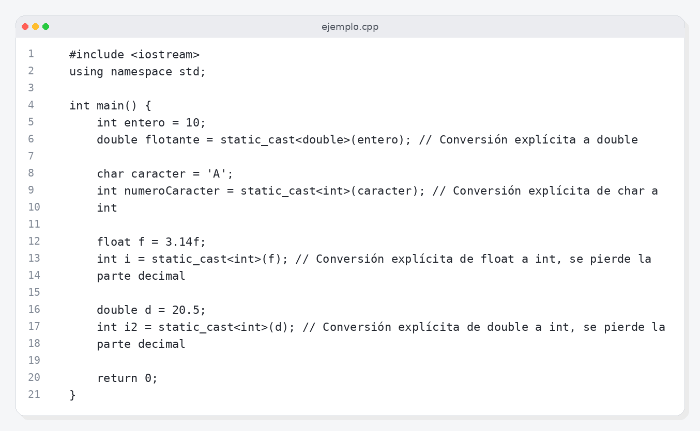

### Explicación paso a paso

#### Paso 1

Líneas 1 a 3:

  1: \#include <iostream>
  2: using namespace std;
  3: 

En este paso se importa la biblioteca de entrada y salida estándar usando `using namespace std;` y se define la función principal `int main()`. Dentro de `main`, se declara una variable entera llamada `entero` con el valor 10 y se asigna a una variable de tipo `double` llamada `flotante` mediante una conversión explícita usando `static_cast<double>(entero)`. Se también declara un caracter que se convierte en entero y se asigna a una variable de tipo `int`, así como un float que se convierte en int, perdiendo la parte decimal.

#### Paso 2

Líneas 4 a 7:

  4: int main() {
  5:     int entero = 10;
  6:     double flotante = static\_cast<double>(entero); // Conversión explícita a double
  7: 

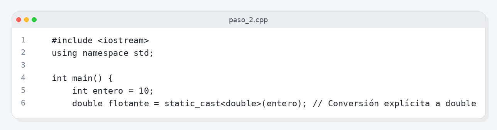

En este paso se declara una variable de tipo `char` llamada `caracter` con el valor 'A'. Luego, esta variable es convertida en un entero utilizando la función `static_cast<int>(caracter)`. Finalmente, una variable float es asignada a un int mediante una conversión explícita también usando `static_cast<int>(f)` y otra variable de tipo double es asignada a un int con una conversión explícita también utilizando `static_cast<int>(d)`, en ambos casos perdiendo la parte decimal.

---

## Comentarios.

### Explicación

Los comentarios en C++ son un medio invaluable para documentar el código, facilitando su entendimiento y evitando confusiones durante el desarrollo del programa. Estos pueden ser adicionados al principio de una línea con // o a partir de la segunda columna con /*...*/ si se trata de bloques de múltiples líneas.

Los comentarios son textos que no están destinados a ejecutarse, por lo general enlazados con el código fuente. Su propósito principal es explicar ideas, procesos y lógica detrás del programa. También pueden ser usados para dejar notas temporales que luego se eliminarán durante la fase de limpieza.

En C++, hay dos tipos principales de comentarios: los simples (inline) con // y los dobles (multilinea) con /*...*/. Los comentarios inline solo ocurren en una sola línea, mientras que los multilineas pueden extenderse a través de varias líneas de código, siendo más útil para explicar conceptos o pasos más complejos.

Una vez agregados al código fuente, los comentarios no son ejecutados ni leídos por la máquina, sino solo por el compilador. El diseño de C++ se basa en la idea de que un compilador puede ignorar todo el contenido de comentario. Esto permite una mayor flexibilidad y eficiencia durante el proceso de compilación.

Es importante mantener los comentarios actualizados con información relevante para asegurar que sigan siendo útiles y proporcionen un entorno de documentación coherente. Esto ayuda a otros programadores, futuros versiones del mismo código o cualquier persona que tenga que leer el código en un futuro lejano.

### Ejemplo completo en C++

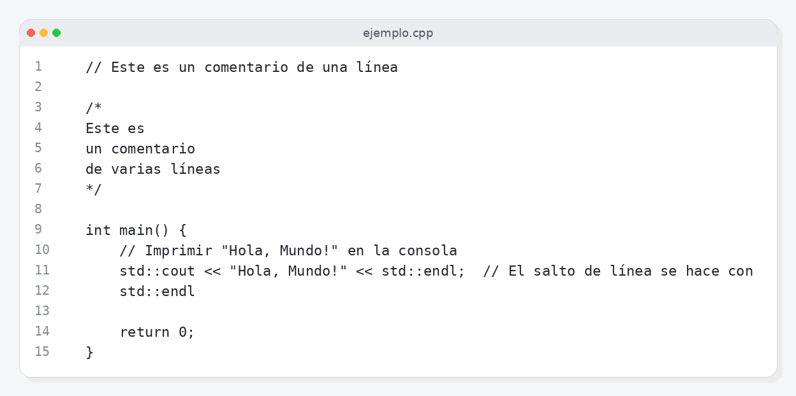

### Explicación paso a paso

#### Paso 1

Líneas 1 a 3:

  1: // Este es un comentario de una línea
  2: 
  3: /\*

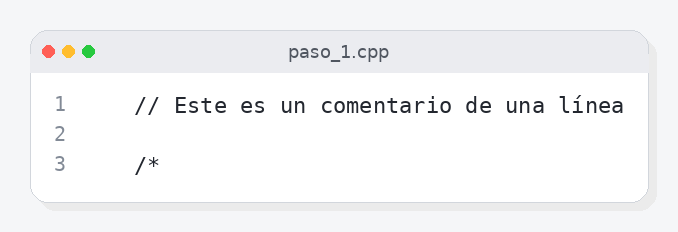

Las líneas 1 a 3 contienen un comentario de una sola línea y un comentario de varias líneas. El código principal empieza después de estos comentarios.

#### Paso 2

Líneas 4 a 7:

  4: Este es 
  5: un comentario 
  6: de varias líneas
  7: \*/

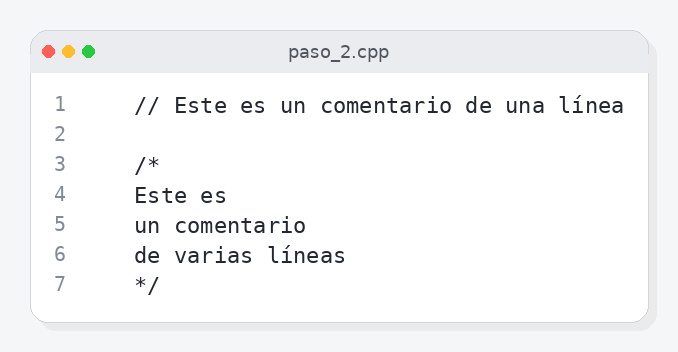

En las líneas 4 a 7 se encuentra el cuerpo del programa `main`. En esta parte, se utiliza la función `std::cout` para imprimir una cadena de texto en consola. La instrucción `std::endl` asegura que la salida de texto se muestre en una nueva línea después de imprimir 'Hola, Mundo!'.

---

# Utilización de objetos

